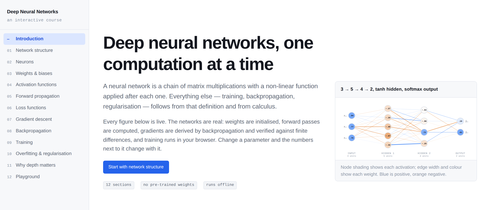

# Deep Neural Networks — an interactive course

A visualisation-first course on deep neural networks. Every figure is a live
network: weights are initialised, forward passes are computed, gradients are
derived by backpropagation and training runs in the browser. There are no
pre-recorded animations and no placeholder controls.

No mathematical background is assumed. Section 00 teaches the notation the rest
of the course uses — sums, vectors, derivatives, the chain rule — with an
interactive for each. After that, every section pairs its figure with the
mathematics behind it: the claim in one paragraph, a plain-language restatement
of every equation, and the full derivation in a collapsible block, so nothing is
asserted without proof and the page still reads as a sequence of experiments
rather than a textbook.

Each section also links to a **Jupyter notebook** that makes you build the thing
it just showed you. Thirteen notebooks, 53 exercises, plain numpy — see
[`notebooks/`](notebooks/README.md). The site teaches by manipulation; the
notebooks teach by implementation, and by the end of them you will have written
a working neural network library from an empty file.



## Contents

| # | Section | What it does |
|---|---------|--------------|
| 00 | Reading the mathematics | Σ, vectors and matrices, derivatives and the chain rule, each with a live panel. Skippable if familiar |
| 01 | Network structure | Reshape an architecture and watch the layer shapes and parameter count follow |
| 02 | Neurons | One neuron, two inputs; the weighted sum, the bias and the line `z = 0` in the input plane |
| 03 | Weights & biases | Edit any entry of `W` or `b`; measure how activation and gradient scale compound over 10 layers as the initialisation gain changes |
| 04 | Activation functions | ReLU, sigmoid, tanh, leaky ReLU with their derivatives; softmax over adjustable logits with a temperature control |
| 05 | Forward propagation | Step through `z⁽¹⁾ → a⁽¹⁾ → z⁽²⁾ → ŷ` with the real numbers and the matrix form side by side |
| 06 | Loss functions | MSE, binary cross-entropy and categorical cross-entropy as functions of the prediction |
| 07 | Gradient descent | `θ ← θ − η ∇L(θ)` on four 1-D landscapes and on a 2-D least-squares surface, with momentum and an adjustable condition number |
| 08 | Backpropagation | Step the backward pass, expand the chain rule for any weight, verify it against finite differences |
| 09 | Training | Mini-batch training on five datasets with a live decision boundary and metric curves |
| 10 | Overfitting & regularisation | Train/validation split, L2, dropout and early stopping |
| 11 | Why depth matters | Four depths trained in lockstep, hidden-unit responses, linear-region counts |
| 12 | Playground | Everything combined, with a probe point and a per-unit / per-weight inspector |

## Running it

```bash
npm install
npm run dev          # development server
npm run build        # production build into dist/
npm run preview      # serve the production build on :4173
```

The built site is static and has no network dependencies at runtime.

The notebooks are separate and need only Python:

```bash
python -m venv .venv && source .venv/bin/activate
pip install -r notebooks/requirements.txt jupyterlab
jupyter lab notebooks/
```

## Tests

```bash
npm test               # numerical correctness of the network engine — 24 tests
npm run test:browser   # every interactive control — 103 checks, needs a preview server
npm run notebooks:check # the committed notebooks match notebooks/src
python tools/run_notebooks.py  # execute all 13 solution notebooks
```

`npm test` is the important one. It gradient-checks backpropagation against
central finite differences for every combination of hidden activation
(`relu`, `leakyRelu`, `sigmoid`, `tanh`), output head (`sigmoid`, `softmax`,
`linear`) and loss (`mse`, `bce`, `cce`), for networks with zero, one, two and
four hidden layers, and requires a relative error below `1e-5`. It also checks
the softmax Jacobian, the loss derivatives, the update rule, momentum, the
`2/λ_max` stability bound, that feature scaling changes the condition number
without changing the fit, dataset balance and reproducibility, and that a network
with no hidden layer fails on XOR while solving a linearly separable set.

`npm run test:browser` needs a preview server on port 4173 and Playwright's
Chromium. It drives 103 checks across all thirteen sections — sliders, buttons,
selects, canvas clicks, training runs, navigation, theme switching and mobile
layout — and asserts on the values the page displays: that `BCE(0.8, y=1)` reads
`0.2231`, that one descent step equals `θ − η∇L`, that the on-screen chain-rule
product equals the value backpropagation produced, that softmax with logits of
102/101/100.1 returns the same probabilities as 2/1/0.1 rather than NaN, and that
a gain of 0.7 makes activations vanish over ten layers while 1.41 keeps them
flat. The prerequisites section is checked the same way: the Σ panel's running
total must equal the sum of its terms, the matrix-vector product must be
[0, 9, 1], shrinking the nudge must bring rise ÷ run within 0.001 of the exact
derivative, and the chain-rule product must match a direct measurement. Set
`CHROMIUM_PATH` to use a system Chromium instead of a downloaded one.

`tools/run_notebooks.py` executes every solution notebook top to bottom and
fails if any cell raises — which includes all 53 `check.*` calls inside them. It
is what proves the exercises are solvable as written.

## Layout

```
src/
  lib/                 the mathematics, with no UI dependencies
    activations.ts     f(z) and f'(z) for each activation; softmax and its Jacobian
    losses.ts          MSE, BCE, CCE with their derivatives
    network.ts         the MLP: forward, backward, mini-batch training, L2, dropout
    optimisation.ts    1-D loss landscapes, least-squares descent, momentum, curvature
    datasets.ts        linear, XOR, circles, moons, spiral
    contour.ts         marching squares, used for decision boundaries and contours
    rng.ts             seeded RNG so every figure is reproducible
    format.ts          number formatting
  components/
    ui/                controls, panels, stat tiles, KaTeX wrappers
    viz/               Plot frame, network diagram, decision boundary, contours, metric charts
    layout/            section shell
  hooks/               mutable network, trainer, ensemble trainer, scroll spy, theme
  sections/            one file per section, plus the registry that orders them
                       (00-notation.tsx is the prerequisites primer)
tests/
  network.test.ts      numerical tests
  browser/             end-to-end interaction tests
notebooks/
  src/                 the notebooks' source of truth (percent format)
  *.ipynb              generated student notebooks, solutions removed
  solutions/*.ipynb    generated solution notebooks, executed in CI
  dnn/                 datasets, plotting, checks, and a reference MLP
tools/
  build_notebooks.py   src/*.py -> student and solution notebooks
  run_notebooks.py     execute the solutions, fail on any error
```

`src/lib` is plain TypeScript with no React imports, so the engine can be read,
tested and reused on its own.

## Implementation notes

**Index convention.** `W[l][j][i]` is the weight from unit `i` of layer `l` to
unit `j` of layer `l+1`. Layer 0 is the input and holds no parameters.

**Backpropagation.** `δ⁽ᴸ⁾ = ∂L/∂z⁽ᴸ⁾` is formed at the output and propagated with
`δ⁽ˡ⁾ = (W⁽ˡ⁺¹⁾)ᵀ δ⁽ˡ⁺¹⁾ ⊙ f′(z⁽ˡ⁾)`; parameter gradients are
`∂L/∂W⁽ˡ⁾ = δ⁽ˡ⁾ (a⁽ˡ⁻¹⁾)ᵀ` and `∂L/∂b⁽ˡ⁾ = δ⁽ˡ⁾`. Sigmoid+BCE and softmax+CCE
use the simplification `δ⁽ᴸ⁾ = ŷ − y`; every other pairing goes through the
explicit `∂L/∂ŷ · f′(z)` path, including the full softmax Jacobian.

**Initialisation.** He (`σ² = 2/fan_in`) for ReLU-family units, Glorot
(`σ² = 2/(fan_in + fan_out)`) for saturating units.

**Regularisation.** L2 is `(λ/2)Σw²`, contributing `λW` to the gradient; biases
are not regularised. Dropout is inverted dropout: hidden activations are masked
and divided by `1 − p` during training only. Both can be changed mid-run without
resetting the weights.

**Training loop.** Mini-batch gradient descent, one or more epochs per animation
frame, with the learning rate and batch size read from refs so they take effect
immediately. Reported losses are recomputed on the full set after each epoch with
dropout disabled.

**Momentum.** The heavy-ball form `v ← βv + ∇L`, `θ ← θ − ηv`, which reduces to
plain gradient descent at `β = 0`. Used in the gradient-descent section only; the
training sections use plain mini-batch SGD so that what you see is the rule the
earlier sections derived.

**Conditioning.** The least-squares Hessian is constant, so its eigenvalues are
computed in closed form and reported live. A feature-scale control multiplies the
input values, which stretches one axis of the loss surface and raises the
condition number from about 1.5 to about 32 without changing the fitted line —
the same effect unnormalised inputs have on a real objective.

**Decision boundaries.** The output is swept over a grid, drawn as a raster, and
the `p = 0.5` level set is extracted with marching squares so the boundary is a
line rather than a colour change.

## Libraries

`react` for components, `katex` for mathematical notation, `d3-scale` and
`d3-shape` for scales and path generation. The diagrams, plots, contours and
decision boundaries are written directly in SVG and canvas — a charting library
would not draw a network with per-weight interaction or a probability field with
an extracted level set.
